Connecting the schema to any project is the way to connect the normal image 
```
<!DOCTYPE html>
<html lang="en">

<head>...</head>

<body>
  <!-- Adding to the page -->
  
  <!-- If, something went wrong in the first case -->
  <object data="dist/stooller-diagram__how-it-works.svg" type="image/svg+xml"></object>
</body>

</html>
```
https://apalion1493.github.io/stooler-scheme/dist/stooller-diagram__how-it-works.svg
https://apalion1493.github.io/stooler-scheme/src/stooller-diagram__how-it-works.svg
https://apalion1493.github.io/stooler-scheme/index.html
